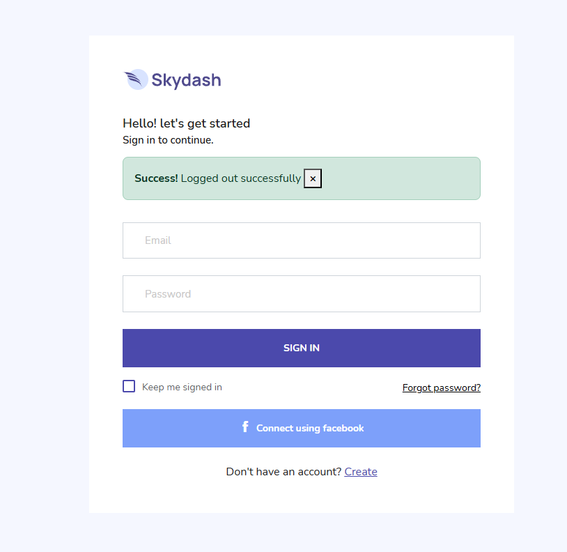
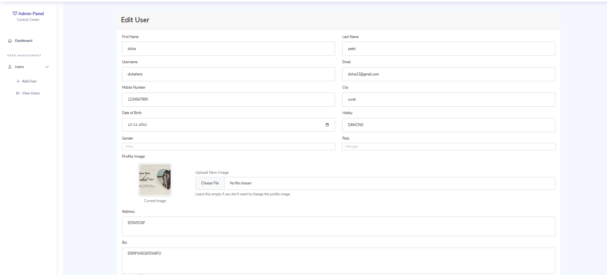
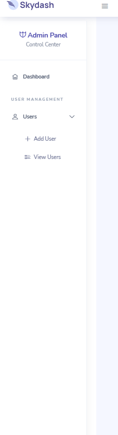

# Admin Panel

A full-stack Admin Panel built using **Node.js**, **Express.js**, **MongoDB**, **Mongoose**, **EJS**, and **Bootstrap**. The application provides complete CRUD operations with secure authentication, profile management, avatar uploads, and a modern admin dashboard.

---

## Features

### Authentication
- User Registration
- User Login
- Cookie-based Authentication
- Password Hashing using bcrypt
- Forgot Password
- Change Password
- Logout
- Protected Routes using Authentication Middleware

### User Management (CRUD)
- Add New User
- View All Users
- View User Profile
- Edit User Details
- Delete User
- Upload Profile Avatar

### Profile
- Personal Information
- Profile Picture
- Password Security Section
- Change Password Option

### Additional Features
- Flash Messages
- Form Validation
- Duplicate Email & Username Validation
- Image Upload using Multer
- Responsive Admin Dashboard
- Modern Sidebar Navigation

---

## Technologies Used

### Frontend
- HTML5
- CSS3
- Bootstrap 5
- EJS

### Backend
- Node.js
- Express.js

### Database
- MongoDB
- Mongoose

### Authentication & Security
- bcrypt
- Cookies

### File Upload
- Multer

---

## User Model

The application stores the following user information:

- First Name
- Last Name
- Email
- Username
- Password (Hashed)
- Mobile Number
- City
- Date of Birth
- Hobby
- Gender
- Address
- Role
- Bio
- Avatar

---

## Project Structure

```
project/
│
├── controller/
├── middleware/
├── model/
├── routes/
├── uploads/
├── views/
│   ├── partials/
│   ├── samples/
│   ├── add-user.ejs
│   ├── edit-user.ejs
│   ├── view-page.ejs
│   └── view-user.ejs
│
├── public/
│   ├── css/
│   ├── js/
│   └── images/
│
├── app.js
├── package.json
└── README.md
```

---

## CRUD Operations

### Create
Creates a new user after validating the input, hashing the password, and storing the data in MongoDB.

### Read
Displays all users and individual user details.

### Update
Updates user information and profile avatar.

### Delete
Removes the selected user from the database.

---

## Authentication Flow

1. User logs in using Email and Password.
2. Password is verified using bcrypt.
3. A secure HTTP-only cookie (`userId`) is created.
4. Protected routes are verified using the `isAuthenticated` middleware.
5. User logs out by clearing the authentication cookie.

---


---

## Environment Variables

Create a `.env` file in the project root.

```env
PORT=3000
MONGO_URI=your_mongodb_connection_string
```

---

## Screenshots


- Login Page




- Dashboard


- Add User


- View Users


- User Profile


- Edit User




- Sidebar




---

## Demo Video

Video Link:

[FIRST VERSION FOR ADMIN PANEL WITH COOKIE](https://drive.google.com/file/d/1b1Y3Y1vtrEbY197hbw5gtlTf31krjnqA/view?usp=drive_link)

---

## Future Improvements

- Role-based Authorization
- Search & Filter Users
- Pagination
- Email Verification
- Password Reset using OTP
- Dashboard Analytics

---

## Author

**PALAK**

---

## License

This project is developed for educational purposes.
